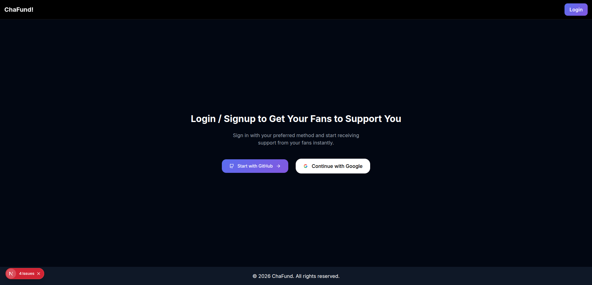
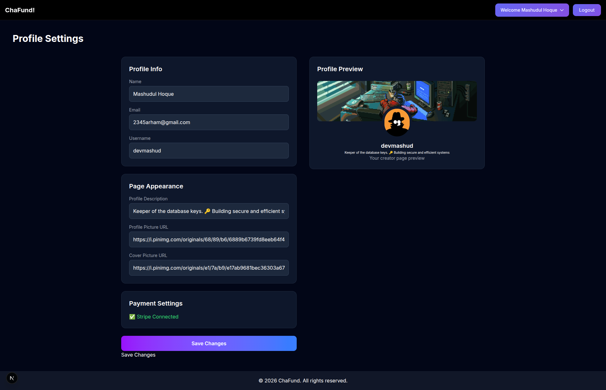

# ☕ ChaFund

ChaFund is a modern creator-support platform that allows developers and creators to receive funding from their fans — one chai at a time.

## 🚀 Features

- 🔐 Social Login (Google, GitHub, Facebook, Email)
- 💳 Micro-support / Donation system
- 👤 Creator profile pages
- 📊 Dashboard for managing supporters
- 🌙 Modern responsive UI (Next.js + Tailwind CSS)

## 🛠️ Tech Stack

- Next.js
- React
- Tailwind CSS
- NextAuth
- Payment Integration

## 🎯 Goal

ChaFund aims to empower developers and creators by giving them a simple and accessible way to receive support from their community.

---

Built with ❤️ by a Bangladeshi developer 🇧🇩

## Screenshot

